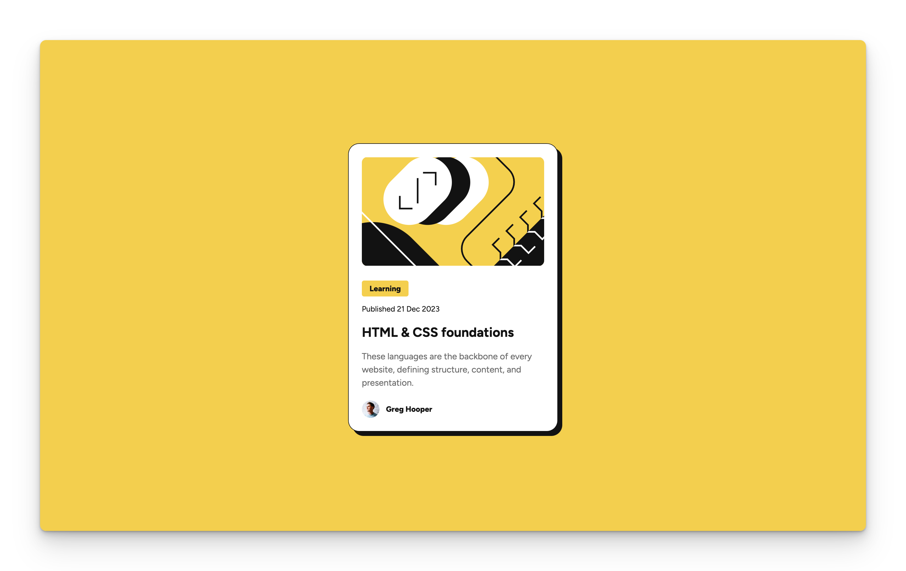

# Frontend Mentor - Blog preview card solution

This is a solution to the [Blog preview card challenge on Frontend Mentor](https://www.frontendmentor.io/challenges/blog-preview-card-ckPaj01IcS). Frontend Mentor challenges help you improve your coding skills by building realistic projects.

## Table of contents

- [Overview](#overview)
  - [The challenge](#the-challenge)
  - [Screenshot](#screenshot)
  - [Links](#links)
- [My process](#my-process)
  - [Built with](#built-with)
  - [What I learned](#what-i-learned)
  - [Continued development](#continued-development)
  - [Useful resources](#useful-resources)
- [Author](#author)
- [Acknowledgments](#acknowledgments)

## Overview

### The challenge

Users should be able to:

- See hover and focus states for all interactive elements on the page

### Screenshot

### Links

- Solution URL: [Git Repository](https://your-solution-url.com)
- Live Site URL: [Live Example](https://your-live-site-url.com)

## My process

### Built with

- Semantic HTML5 markup
- CSS custom properties
- Flexbox
- Sass nested properties

### Continued development

I would like to learn about having further clarity about when to use rem units vs pixels especially when it comes to spacing. I find it easier to undersdtand when and why to use rem vs pixels when it comes to font sizes, but less about when to use rem for spacing of elements with padding & margins.

## Author

- Website - [Joshua Douglas Github](https://github.com/joshuadouglas)
- Frontend Mentor - [@joshuadouglas](https://www.frontendmentor.io/profile/joshuadouglas)
